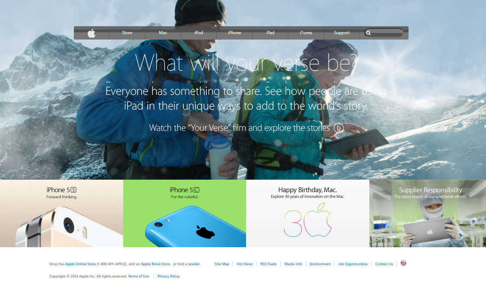

# apple-clone home page
This repository contains a clone home page of apple.com home page of 2014

## Below is a screenshop of the completed page

## Built With

- HTML
- CSS
- ionic icons
-Awesome Icons
- visual Studio IDE 
- linters

## apple.com home page Link

[Apple.com clone home page Link](https://gango-anan.github.io/apple-clone/)

## Getting Started

### To run this project:
- Install a web browser of your choice prefferably Google chrome or mozilla firefox.
- Download xAMPP application from [xampp site](https://www.apachefriends.org/index.html) and make sure to choose the version that works for your system.
- Install the XAMPP application you downloaded to your system using the instructions on XAMPP website for help with configuring it.- Copy the New York Times Clone project files to the XAMPP folder.
- Open your browser and type in localhost/index.html, your project should be running at this point.
- Thank you.

## Authors
- Name: GALIWANGO ANANIYA 
- GitHub: [@gango-anan](https://github.com/gango-anan)
- Twitter: [@gango_anan](https://twitter.com/gango_anan)
- LinkedIn: [galiwango-ananiya-0800821b4](https://linkedin.com/galiwango-ananiya-0800821b4)

## Show your support

Give a ⭐️ if you like this project!

## Acknowledgments

- A big thank you to my stand up team for the support offered to me during the peer-to-peer code review meetings, the observations they made helped make this project successful

## 📝 License

This project is [MIT](https://github.com/gango-anan/apple-clone/blob/space-ripples-page/LICENSE) licensed.

